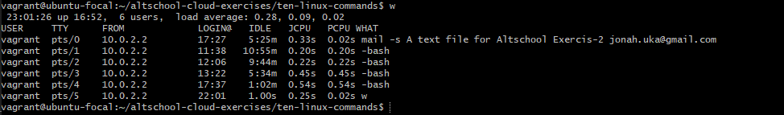
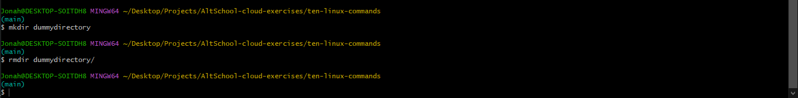

# List 10 Linux Commands

1. du -ah command
 
> Display disk usage for all files and directories in human readable format

2. w command

> Show who is logged in and what they are doing

3. rmdir command

> Deletes a directory

4. lsof command

> List all open files on the system

5. locate command

> Find files and directories by name

6. iostat l command

> Display I/O statistics

7. free -h command

> Display free and used memory in human readable form

8. ip a command

> Display all network interfaces and IP address

9. find DIR -name 'prefix*' command

> find files in DIR that start with "prefix"

10. history command

> Gives a list of all past commands typed in the current terminal session

